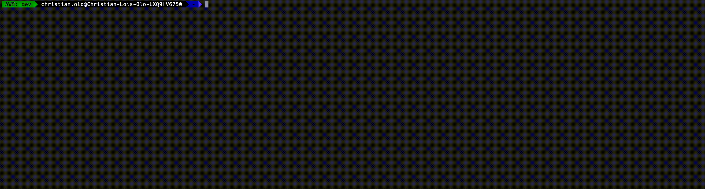

# interactive-cli-leetcode-solutions

C++ (.cpp) based LeetCode problem solutions with an interactive CLI.

## Installation

Install the package globally

```
npm i -g interactive-cli-leetcode-solutions
```

## Running the CLI

The package provides a bin command to run the interactive-cli

Run the following command to star the CLI session

```
interactive-cli-leetcode-solutions
```
or
```
npx interactive-cli-leetcode-solutions
```

## Sample


